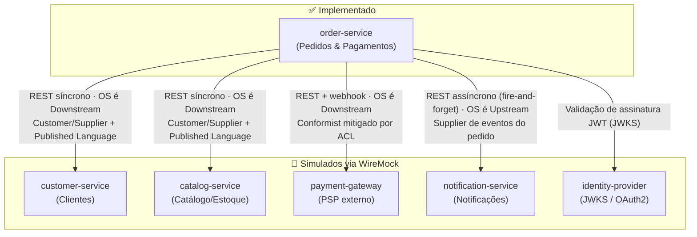
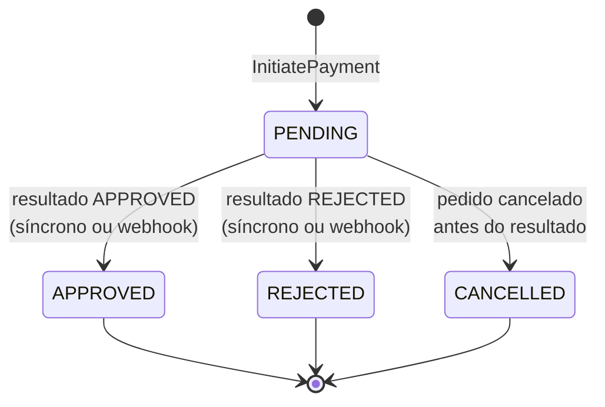
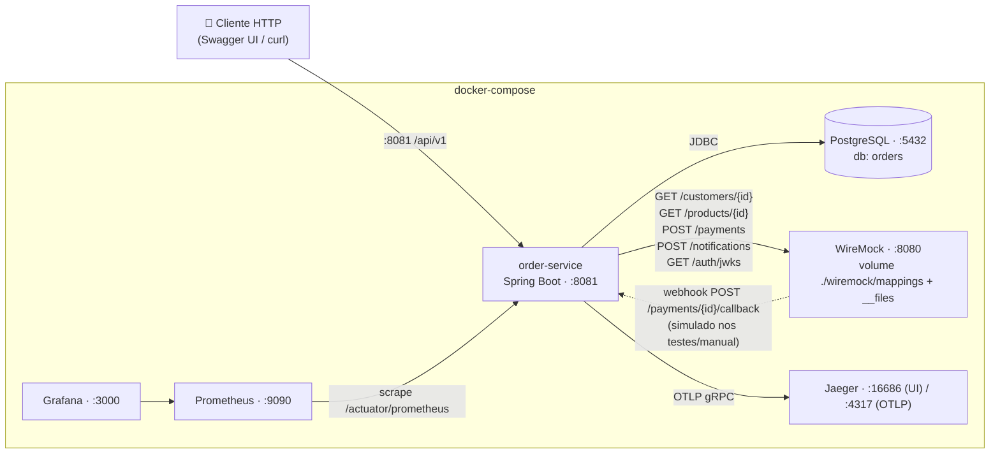

# Arquitetura — Plataforma de Pedidos para E-commerce

> Documento de arquitetura do projeto final. Define a decomposição do domínio, os contratos entre serviços, a máquina de estados do pedido, a arquitetura interna do `order-service` e as decisões técnicas (ADRs). **Apenas o `order-service` é implementado**; todos os demais serviços são simulados por um servidor WireMock standalone, cujos mapeamentos em `wiremock/mappings/` materializam exatamente os contratos definidos aqui.

---

## 1. Decomposição do Domínio e Bounded Contexts

### 1.1 Serviços identificados

| # | Serviço | Status | Responsabilidade única | Dados que possui (ownership) |
|---|---------|--------|------------------------|------------------------------|
| 1 | **order-service** | **Implementado** | Orquestrar o ciclo de vida do pedido: criação, gestão de itens, confirmação, pagamento e cancelamento, garantindo as invariantes de negócio (estados, idempotência, concorrência, limite de tentativas). | `orders`, `order_items`, `payments`, chaves de idempotência, eventos de webhook processados, outbox de eventos de domínio. |
| 2 | **customer-service** | Simulado (WireMock) | Cadastro e ciclo de vida de clientes (ativo, bloqueado, inexistente). Fonte de verdade sobre identidade comercial do cliente. | `customers` (perfil, status, endereços). |
| 3 | **catalog-service** | Simulado (WireMock) | Catálogo de produtos: existência, **preço vigente** e **disponibilidade de estoque**. Fonte de verdade de preço — por isso o total do pedido é calculado consultando-o na confirmação. | `products`, `inventory`, histórico de preços. |
| 4 | **payment-gateway** | Simulado (WireMock) | Processador de pagamentos **externo** (adquirente/PSP). Autoriza ou rejeita transações e envia o resultado também via webhook. | `transactions` (lado do PSP). |
| 5 | **notification-service** | Simulado (WireMock) | Envio assíncrono de notificações (e-mail/SMS/push) sobre eventos relevantes do pedido. | Templates, preferências de canal, log de envios. |
| 6 | **identity-provider** | Simulado (WireMock — endpoint JWKS) | Emissão e publicação de chaves para validação de JWT (OAuth2). O `order-service` atua apenas como *resource server*. | Usuários/credenciais, chaves de assinatura. |

### 1.2 Por que cada um é um Bounded Context separado

- **Linguagem ubíqua distinta**: "cliente" no contexto de Pedidos é apenas `customerId` + status de elegibilidade; no contexto de Clientes é um agregado rico (perfil, KYC, bloqueios). "Produto" em Pedidos é uma *snapshot* (`productId`, nome, preço unitário no momento da confirmação); no Catálogo é um agregado com estoque e precificação.
- **Ownership de dados e ciclo de vida independentes**: preço muda sem o pedido saber; status do cliente muda sem o pedido saber. Cada contexto evolui e escala de forma independente.
- **Fronteiras transacionais**: a única transação ACID do sistema é interna ao `order-service`. Entre contextos a consistência é eventual (eventos) ou verificada no instante da operação (chamadas síncronas de validação).
- **O gateway de pagamento é um sistema de terceiro**: não controlamos seu modelo nem seu contrato — exige uma **Anti-Corruption Layer (ACL)**.

### 1.3 Context Map



Leitura do mapa:

- **order-service → customer-service / catalog-service**: relação **Customer/Supplier** com **Published Language** (contratos REST definidos na §2). O `order-service` consome dados de validação no instante da operação (criação do pedido, adição de item, confirmação).
- **order-service → payment-gateway**: como o PSP é externo, a relação tende a **Conformist**; mitigamos com uma **ACL** (`PaymentGatewayAdapter` + DTOs próprios) que traduz o vocabulário do gateway (`APPROVED/REJECTED`, `transactionId`) para o modelo de domínio (`PaymentStatus`).
- **order-service → notification-service**: o `order-service` é **Upstream**: publica fatos do pedido; falha na notificação **nunca** falha a transação de negócio (fire-and-forget com retry).
- **identity-provider**: relação puramente de infraestrutura de segurança (o serviço só valida tokens via JWKS).

---

## 2. Comunicação e Contratos

Todos os contratos abaixo são **normativos**: os arquivos de `wiremock/mappings/` devem implementá-los literalmente, e os testes de integração (WireMock via Testcontainers) reutilizam os mesmos mapeamentos. IDs fixos são usados para tornar os cenários determinísticos.

### 2.1 Customer Service — `GET /customers/{customerId}`

| Cenário | ID fixo (mapping) | Status | Corpo de resposta |
|---|---|---|---|
| Cliente ativo | `11111111-1111-1111-1111-111111111111` | `200` | ver abaixo |
| Cliente bloqueado | `22222222-2222-2222-2222-222222222222` | `422` | problem+json |
| Cliente não encontrado | qualquer outro (mapping default, prioridade baixa) | `404` | problem+json |

```json
// 200 — customers-active.json
{ "id": "11111111-1111-1111-1111-111111111111", "name": "Alice Souza", "email": "alice@example.com", "status": "ACTIVE" }

// 422 — customers-blocked.json (application/problem+json)
{ "type": "https://api.ecommerce.dev/problems/customer-blocked", "title": "Customer blocked", "status": 422, "detail": "Customer 2222... is blocked" }

// 404 — customers-not-found.json (application/problem+json)
{ "type": "https://api.ecommerce.dev/problems/customer-not-found", "title": "Customer not found", "status": 404 }
```

### 2.2 Catalog Service — `GET /products/{productId}`

| Cenário | ID fixo | Status | Observação |
|---|---|---|---|
| Produto disponível com preço | `aaaaaaaa-aaaa-aaaa-aaaa-aaaaaaaaaaaa` | `200` | preço `199.90 BRL` |
| Segundo produto disponível | `cccccccc-cccc-cccc-cccc-cccccccccccc` | `200` | preço `49.90 BRL` (cenários multi-item) |
| Produto indisponível | `bbbbbbbb-bbbb-bbbb-bbbb-bbbbbbbbbbbb` | `422` | problem+json `product-unavailable` |
| Produto não encontrado | qualquer outro (default) | `404` | problem+json `product-not-found` |

```json
// 200 — products-available.json
{
  "id": "aaaaaaaa-aaaa-aaaa-aaaa-aaaaaaaaaaaa",
  "name": "Teclado Mecânico TKL",
  "available": true,
  "price": { "amount": 199.90, "currency": "BRL" }
}
```

> O preço retornado por este endpoint é a **fonte do cálculo do total na confirmação** (ADR-005).

### 2.3 Payment Gateway — `POST /payments`

Requisição enviada pelo `order-service` (ACL — DTO próprio):

```json
{
  "paymentId": "<uuid gerado pelo order-service>",
  "orderId": "<uuid>",
  "amount": { "amount": 399.80, "currency": "BRL" },
  "method": { "type": "CARD", "cardToken": "tok-approved" }
}
```

O cenário é selecionado pelo `cardToken` (casamento por `matchesJsonPath`):

| `cardToken` | Status HTTP | Corpo | Mapping |
|---|---|---|---|
| `tok-approved` | `200` | `{ "transactionId": "tx-0001", "status": "APPROVED", "paymentId": "{{jsonPath request.body '$.paymentId'}}" }` | `payments-approved.json` |
| `tok-rejected` | `200` | `{ "transactionId": "tx-0002", "status": "REJECTED", "reason": "insufficient_funds", "paymentId": "..." }` | `payments-rejected.json` |
| `tok-unstable` | `503` | `{ "error": "gateway_unavailable" }` (com `fixedDelayMilliseconds` para exercitar timeout) | `payments-unstable.json` |

Além da resposta síncrona, o gateway envia o resultado de forma assíncrona via **webhook** para `POST /api/v1/payments/{paymentId}/callback`. O corpo do webhook:

```json
{ "eventId": "evt-<uuid>", "paymentId": "<uuid>", "status": "APPROVED", "transactionId": "tx-0001", "occurredAt": "2026-06-12T12:00:00Z" }
```

A deduplicação é feita por `eventId` (ADR-002).

### 2.4 Notification Service — `POST /notifications`

```json
// request
{ "recipientId": "<customerId>", "channel": "EMAIL", "template": "ORDER_PAID", "payload": { "orderId": "<uuid>", "total": "399.80 BRL" } }
// response: 202 Accepted — { "notificationId": "ntf-0001", "status": "ACCEPTED" }
```

### 2.5 Identity Provider — `GET /auth/.well-known/jwks.json`

Mapping `auth-jwks.json` servindo o JWKS com a **chave pública RSA do projeto** (par de chaves de desenvolvimento versionado em `wiremock/__files/`). O `order-service` é configurado como resource server apontando para essa URI (ADR-006). Um utilitário de testes/script gera tokens assinados com a chave privada, com escopos configuráveis.

### 2.6 Eventos de negócio do ciclo de vida

| Evento | Publicado por | Consumidores (conceituais) | Gatilho |
|---|---|---|---|
| `OrderCreated` | order-service | analytics, antifraude | `POST /orders` com cliente ativo |
| `OrderItemAdded` / `OrderItemRemoved` | order-service | analytics | mutação de itens em `CREATED` |
| `OrderConfirmed` | order-service | catalog (reserva de estoque), notification | confirmação com ≥1 item |
| `PaymentInitiated` | order-service | antifraude | `POST /payments` |
| `PaymentApproved` / `PaymentRejected` | payment-gateway → internalizado pelo order-service | order-service (transição de estado), notification | resposta síncrona ou webhook |
| `OrderPaid` | order-service | notification, logística (futuro) | pagamento aprovado |
| `OrderCancelled` (com `reason`: `CUSTOMER_REQUEST` \| `PAYMENT_ATTEMPTS_EXCEEDED`) | order-service | notification, catalog (liberação de reserva) | cancelamento manual ou 3ª rejeição |

**Decisão de publicação (ver ADR-008):** como só o `order-service` existe, não há broker. Os eventos são (a) persistidos em uma tabela **outbox** (`domain_events`) na mesma transação da mudança de estado e (b) emitidos como **log estruturado JSON**. A entrega real a um broker fica modelada conceitualmente. A única "entrega" real hoje é a chamada HTTP ao notification-service nos eventos `OrderConfirmed`, `OrderPaid` e `OrderCancelled` (fire-and-forget resiliente).

---

## 3. Máquina de Estados

### 3.1 Estados do Pedido

```mermaid
stateDiagram-v2
    [*] --> CREATED : POST /orders<br/>[cliente ativo e sem pedido ativo]
    CREATED --> CONFIRMED : confirm<br/>[itens ≥ 1; total recalculado no catálogo]
    CREATED --> CANCELLED : cancel
    CONFIRMED --> PAYMENT_PENDING : initiatePayment
    CONFIRMED --> CANCELLED : cancel
    PAYMENT_PENDING --> PAID : PaymentApproved
    PAYMENT_PENDING --> CONFIRMED : PaymentRejected<br/>[rejeições < 3]
    PAYMENT_PENDING --> CANCELLED : PaymentRejected<br/>[rejeições == 3] / auto-cancel
    PAYMENT_PENDING --> CANCELLED : cancel<br/>[pagamento ainda não aprovado]
    PAID --> [*]
    CANCELLED --> [*]
```



### 3.2 Tabela normativa de transições

| Estado origem | Evento / comando | Estado destino | Guardas / condições |
|---|---|---|---|
| — | `CreateOrder` | `CREATED` | Cliente existe e está `ACTIVE` (customer-service); cliente **não possui** outro pedido em `CREATED`, `CONFIRMED` ou `PAYMENT_PENDING` (índice único parcial). |
| `CREATED` | `AddItem` | `CREATED` | Produto existe e está disponível (catalog-service); `quantity > 0`; se o produto já está no pedido, **incrementa** a quantidade. |
| `CREATED` | `RemoveItem` | `CREATED` | Item existe no pedido; caso contrário → erro 404. |
| `CREATED` | `Confirm` | `CONFIRMED` | Pedido possui ≥ 1 item; preços re-consultados no catálogo **neste instante** e total calculado; produto indisponível na confirmação → erro, permanece `CREATED`. |
| `CREATED` | `Cancel` | `CANCELLED` | Sempre permitido. |
| `CONFIRMED` | `Confirm` | `CONFIRMED` | **Idempotente**: no-op, retorna o estado atual (200). |
| `CONFIRMED` | `AddItem`/`RemoveItem` | — | **Proibido** → 409 (pedido confirmado é imutável em itens). |
| `CONFIRMED` | `InitiatePayment` | `PAYMENT_PENDING` | Não existe pagamento `PENDING` para o pedido; rejeições anteriores < 3. |
| `CONFIRMED` | `Cancel` | `CANCELLED` | Pagamento não aprovado. |
| `PAYMENT_PENDING` | `PaymentApproved` | `PAID` | Pagamento associado em `PENDING`. Idempotente por estado: reprocessar aprovado é no-op. |
| `PAYMENT_PENDING` | `PaymentRejected` | `CONFIRMED` | `paymentAttempts` (rejeições) após incremento < 3 → permite nova tentativa. |
| `PAYMENT_PENDING` | `PaymentRejected` | `CANCELLED` | 3ª rejeição → **cancelamento automático** com `reason = PAYMENT_ATTEMPTS_EXCEEDED`. |
| `PAYMENT_PENDING` | `InitiatePayment` | — | **Proibido** → 409 (idempotência: já existe pagamento em andamento). |
| `PAYMENT_PENDING` | `Cancel` | `CANCELLED` | Permitido (pagamento não aprovado); pagamento `PENDING` é marcado `CANCELLED`. |
| `PAID` | qualquer mutação / `Cancel` | — | **Proibido** → 409 (cancelamento só antes da aprovação). |
| `CANCELLED` | qualquer comando | — | **Proibido** → 409 (pedido cancelado não pode ser modificado em nenhuma hipótese). |

> "Pedido ativo" ≝ pedido em `CREATED`, `CONFIRMED` ou `PAYMENT_PENDING`. A regra "um pedido ativo por cliente" é garantida em duas camadas: caso de uso (consulta) **e** índice único parcial no banco (à prova de corrida).

### 3.3 Estados do Pagamento e relação Pedido ↔ Pagamento



- Relação **1:N**: um pedido pode ter vários pagamentos, mas **no máximo um** em `PENDING` (constraint única parcial). Cada rejeição encerra um pagamento (`REJECTED`, `attemptNumber = n`) e devolve o pedido a `CONFIRMED`; nova tentativa cria **novo** registro de pagamento.
- `Order.paymentAttempts` conta **rejeições**; na 3ª, o agregado dispara `OrderCancelled(PAYMENT_ATTEMPTS_EXCEEDED)`.
- O resultado pode chegar pela resposta síncrona do gateway **e** pelo webhook: ambos convergem para os mesmos métodos de transição do agregado, que são idempotentes por estado.

---

## 4. Arquitetura Interna do `order-service` (Clean Architecture / Hexagonal)

### 4.1 Camadas e pacotes

```
com.ecommerce.orders
├── domain                          # ZERO dependências de Spring/JPA (regra verificada por ArchUnit)
│   ├── model                       # Order, OrderItem, Payment, Money, OrderStatus, PaymentStatus, ...
│   ├── event                       # OrderCreated, OrderConfirmed, PaymentApproved, OrderCancelled, ...
│   └── exception                   # DomainException e subtipos (InvalidStateTransition, EmptyOrder, ...)
├── application
│   ├── usecase                     # 1 classe por caso de uso (ports IN implementados aqui)
│   ├── port
│   │   ├── in                      # interfaces dos casos de uso (CreateOrderUseCase, ConfirmOrderUseCase, ...)
│   │   └── out                     # OrderRepository, PaymentRepository, CustomerGateway, ProductCatalogGateway,
│   │                               # PaymentGatewayPort, NotificationPort, DomainEventPublisher, IdempotencyStore
│   └── dto                         # comandos e resultados (CreateOrderCommand, OrderResult, ...)
└── infrastructure
    ├── web                         # controllers REST, RFC 7807 handler, filtro Idempotency-Key, CorrelationID
    ├── persistence                 # entidades JPA, Spring Data repos, adapters dos ports de persistência, outbox
    ├── client                      # adapters HTTP (RestClient) p/ customer, catalog, gateway, notification + Resilience4j
    ├── security                    # resource server JWT, mapeamento de escopos
    ├── observability               # logging JSON, Micrometer, OpenTelemetry
    └── config                      # wiring (beans), properties
```

**Regra de dependência:** `infrastructure → application → domain`; nunca o inverso. O domínio é Java puro (testável sem contexto Spring), o que viabiliza cobertura ≥ 80% e Pitest MSI ≥ 75% com testes rápidos.

### 4.2 Portas e adaptadores

| Porta (interface) | Camada | Adaptador | Tecnologia |
|---|---|---|---|
| `CreateOrderUseCase`, `ConfirmOrderUseCase`, ... (in) | application | `OrderController`, `PaymentController` | Spring MVC |
| `OrderRepository`, `PaymentRepository` (out) | application | `OrderPersistenceAdapter`, `PaymentPersistenceAdapter` | Spring Data JPA + PostgreSQL |
| `CustomerGateway` (out) | application | `CustomerHttpAdapter` | `RestClient` + Resilience4j |
| `ProductCatalogGateway` (out) | application | `CatalogHttpAdapter` | `RestClient` + Resilience4j |
| `PaymentGatewayPort` (out — ACL) | application | `PaymentGatewayHttpAdapter` | `RestClient` + Resilience4j (CB + retry + timeout) |
| `NotificationPort` (out) | application | `NotificationHttpAdapter` | `RestClient`, fire-and-forget |
| `DomainEventPublisher` (out) | application | `OutboxEventPublisher` | tabela `domain_events` + log JSON |
| `IdempotencyStore` (out) | application | `JpaIdempotencyStore` | tabela `idempotency_keys` |

### 4.3 Modelo de domínio

- **Agregados:** `Order` (root; contém `OrderItem`s; controla a máquina de estados, o contador de rejeições e o total) e `Payment` (root próprio: ciclo de vida e concorrência independentes — o webhook altera `Payment` e, via caso de uso, o `Order`).
- **Entidades:** `OrderItem` (interna ao agregado `Order`).
- **Value Objects:** `Money` (amount + currency, aritmética segura com `BigDecimal`), `OrderStatus`, `PaymentStatus`, `CancellationReason`, `OrderId`, `CustomerId`, `ProductId`, `PaymentId`, `Quantity` (> 0), `IdempotencyKey`, `ProductSnapshot` (id, nome, preço unitário na confirmação).
- **Invariantes (impostas dentro do agregado, nunca no controller):**
  1. `Order` sempre referencia um `CustomerId`.
  2. Transições só pelas regras da §3.2 — qualquer outra lança `InvalidStateTransitionException`.
  3. `confirm()` exige `items.size() ≥ 1` e recebe os preços vigentes para fixar `ProductSnapshot` e calcular `total`.
  4. Itens só mudam em `CREATED`; produto repetido incrementa quantidade; remoção de item ausente lança exceção.
  5. `paymentAttempts ≤ 3`; ao atingir 3 rejeições, auto-cancelamento.
  6. `Payment` só nasce de pedido `CONFIRMED`; no máximo um `PENDING` por pedido.

### 4.4 Casos de uso ↔ endpoints (1:1)

| Caso de uso | Endpoint |
|---|---|
| `CreateOrderUseCase` | `POST /api/v1/orders` |
| `GetOrderUseCase` | `GET /api/v1/orders/{orderId}` |
| `ListCustomerOrdersUseCase` | `GET /api/v1/orders?customerId={id}` |
| `AddOrderItemUseCase` | `POST /api/v1/orders/{orderId}/items` |
| `RemoveOrderItemUseCase` | `DELETE /api/v1/orders/{orderId}/items/{itemId}` |
| `ConfirmOrderUseCase` | `POST /api/v1/orders/{orderId}/confirm` |
| `CancelOrderUseCase` | `DELETE /api/v1/orders/{orderId}` |
| `InitiatePaymentUseCase` | `POST /api/v1/payments` |
| `GetPaymentUseCase` | `GET /api/v1/payments/{paymentId}` |
| `ProcessPaymentCallbackUseCase` | `POST /api/v1/payments/{paymentId}/callback` |

---

## 5. Decisões Técnicas (ADRs)

### ADR-001 — Controle de concorrência: optimistic locking com `@Version`

**Contexto.** Dois processos podem modificar o mesmo pedido simultaneamente. **Decisão.** Optimistic locking: coluna `version` em `orders` e `payments`, mapeada com `@Version`; `OptimisticLockingFailureException` → RFC 7807 `409 Conflict`. **Consequências.** Sem locks longos no banco, melhor throughput em leitura-dominante e contenção rara; cliente recebe 409 e decide reler/repetir. A regra "um pedido ativo por cliente" — corrida entre **inserts** — é garantida por **índice único parcial** (`WHERE status IN (...)`), com violação traduzida para 409.

### ADR-002 — Estratégia de idempotência (3 mecanismos complementares)

**Contexto.** Duplo clique no pagamento, retries de rede e reentrega de webhooks não podem duplicar efeitos. **Decisão.** (1) **Header `Idempotency-Key`** em todo endpoint de mutação: chave + hash do payload + resposta gravados em `idempotency_keys`; replay com a mesma chave e mesmo payload devolve a resposta armazenada; mesma chave com payload diferente → `422`. (2) **Idempotência natural por estado**: `confirm()` em `CONFIRMED` é no-op 200; `initiatePayment` com pagamento `PENDING` → 409. (3) **Webhook idempotente por `eventId`**: tabela `processed_webhook_events` com PK em `event_id`; evento repetido responde 200 sem efeito colateral. TTL de 24h aplicado via job agendado.

### ADR-003 — Resiliência nas chamadas externas (Resilience4j)

**Contexto.** "Quando o gateway está instável (503), toda a plataforma para." **Decisão.** Resilience4j em todos os clientes HTTP: **timeout** (connect 1s / read 2s), **retry** (gateway: 3 tentativas, backoff exponencial 200ms→800ms, apenas para 5xx/timeout), **circuit breaker** por serviço (janela 10 chamadas, abre com 50% de falhas, half-open após 10s). Circuito aberto/retries esgotados no gateway → `502 Bad Gateway` (RFC 7807), pedido permanece consistente. Notificações: fire-and-forget. **Decisão normativa para 502 no gateway:** o `Payment` permanece `PENDING` e o pedido em `PAYMENT_PENDING`; falha de infraestrutura não consome tentativa de negócio.

### ADR-004 — Persistência: PostgreSQL + Flyway; NoSQL não adotado

**Decisão.** PostgreSQL para todo o estado transacional (pedido, itens, pagamentos, idempotência, outbox), migrations versionadas com Flyway, testes com Testcontainers. **Justificativa.** O domínio exige ACID (transição de estado + outbox + contador de tentativas na mesma transação), constraints relacionais (índice único parcial, FKs, CHECK) e `@Version`. NoSQL foi considerado e **rejeitado**: a outbox em JSONB no próprio Postgres cobre auditoria/histórico sem custo operacional de um segundo banco.

### ADR-005 — Total calculado no momento da confirmação

**Contexto.** Preços mudam; o total deve ser baseado no preço **da confirmação**, não da adição. **Decisão.** `AddItem` valida existência/disponibilidade mas **não fixa preço**. `Confirm` re-consulta o catálogo para cada produto, fixa `ProductSnapshot` (preço unitário) nos itens e calcula `total = Σ(preço_confirmação × quantidade)`. Produto indisponível na confirmação → 422 e o pedido permanece `CREATED`.

### ADR-006 — Segurança: JWT resource server com emissor mockado via WireMock (JWKS)

**Decisão.** Spring Security OAuth2 Resource Server validando JWT RS256 contra o JWKS servido pelo WireMock (`/auth/.well-known/jwks.json`); par de chaves de desenvolvimento versionado; utilitário/script gera tokens com escopos. Escopos: `orders:read`, `orders:write`, `payments:read`, `payments:write`. **Justificativa vs. Keycloak:** Keycloak local adiciona ~600MB e setup de realm sem agregar valor avaliativo — o WireMock já está na topologia e o código do resource server é **idêntico** em produção (trocar a URI do issuer). Controles OWASP: Bean Validation em todos os DTOs, headers de segurança, rate limiting simples por IP/token, erros RFC 7807 sem vazamento de stack trace.

### ADR-007 — Observabilidade

**Decisão.** (1) **Logs JSON** (Logback + logstash-encoder) com `correlationId` em MDC: filtro lê `X-Correlation-Id` (ou gera) e os clientes HTTP propagam o header. (2) **Métricas** Micrometer → Prometheus (`/actuator/prometheus`): métricas HTTP, de circuit breaker e de negócio (`orders_confirmed_total`, `payments_rejected_total`, `orders_auto_cancelled_total`). (3) **Tracing** OpenTelemetry exportando OTLP para Jaeger; spans HTTP server/client automáticos. Prometheus + Grafana + Jaeger no docker-compose.

### ADR-008 — Eventos de domínio via outbox + log (sem broker)

**Contexto.** Só o `order-service` existe; não há consumidores reais além do notification-service. **Decisão.** Eventos persistidos na tabela `domain_events` (JSONB) na **mesma transação** da mudança de estado e emitidos como log estruturado; publicação a broker fica modelada (um relay leria a outbox — Transactional Outbox Pattern). Notificações são entregues por chamada HTTP direta pós-commit.

### ADR-009 — Build: Maven, módulo único com fronteiras verificadas por ArchUnit

**Decisão.** Maven (convenção do ecossistema, integração simples com Pitest/JaCoCo/GitHub Actions), projeto em módulo único com pacotes por camada; **ArchUnit** falha o build se `domain` importar Spring/JPA ou se as dependências apontarem para fora. Pitest e JaCoCo com escopo no pacote `domain`.

### ADR-010 — Cancelamento durante `PAYMENT_PENDING` e webhook tardio

**Contexto.** A regra permite cancelar enquanto o pagamento não foi **aprovado**, o que inclui um pagamento em voo. **Decisão.** Cancelamento em `PAYMENT_PENDING` é permitido: o `Payment` `PENDING` vira `CANCELLED`. Se um webhook `APPROVED` chegar depois, ele é registrado (`processed_webhook_events` + evento `LatePaymentResultReceived` na outbox + log `WARN`), **não** altera o pedido (continua `CANCELLED`) e a resposta é 200 — o estorno seria responsabilidade de um fluxo de refund fora do escopo.

---

## 6. Topologia de Execução (docker-compose)



| Container | Imagem | Porta | Observação |
|---|---|---|---|
| order-service | build local (`order-service/Dockerfile`, multi-stage) | 8081 | depende de postgres (healthcheck) e wiremock |
| postgres | `postgres:16-alpine` | 5432 | volume nomeado; Flyway roda no boot do serviço |
| wiremock | `wiremock/wiremock:3` | 8080 | `--global-response-templating`; volume `./wiremock` |
| prometheus | `prom/prometheus` | 9090 | `prometheus.yml` provisionado |
| grafana | `grafana/grafana` | 3000 | datasource + dashboard provisionados |
| jaeger | `jaegertracing/all-in-one` | 16686 / 4317 | recebe OTLP do serviço |

Nos testes de integração, **Testcontainers** sobe `postgres:16-alpine` e `wiremock/wiremock:3` montando o mesmo diretório `wiremock/mappings/` — garantindo que os contratos testados são exatamente os do ambiente local.
